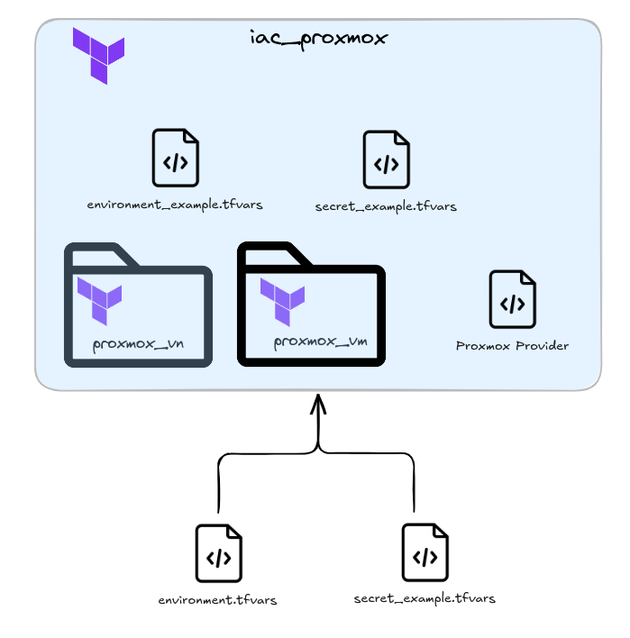

# Iac Proxmox
The project is based on Infrastructure as Code (IaC) through Terraform, for more details see [Official Documentation](https://developer.hashicorp.com/terraform/docs).

This project create and manage virtual machine, virtual local area network and bridge on Proxmox. The project is organised with two modules:
 
* proxmox_vn : this module create bridge and vLAN in proxmox for more detail click [here](./module/proxmox_vn/README.md).
* proxmox_vm: this module create virtual machine in proxmox for more detail click [here](./module/proxmox_vm/README.md)

The figure below shows how the project is organized, the following files are very important:

* environment.tfvars : in this file there are all definition variables in order to provisioning all resources on Proxmox Hypervisor. 
* secret.tfvars : in this file there are the secretes in order to connect on Proxmox Hypervisor and ther is the user and password created in to vm provisioned




### Workspace

> Examples with workspace for demonstration purposes.

```bash
# NOMEWORKSPACE = workspace name
terraform workspace new NOMEWORKSPACE
# init terraform project (download public modules from terraform registry)
terraform init
```

After that edit or view a file under tfvars with variables we may need (number and characteristics machines in the cluster, initial packages, network interfaces, disks, etc.).

To deploy a new infrastructure or just updates, run the following commands:

```bash
# Verify that you are in the right workspace
terraform workspace list
# To see if there are syntactic or form errors (e.g., variable used in a template but is nonexistent)
terraform validate
terraform fmt
# To see if there are syntactic or form errors
terraform validate tfvars
terraform fmt tfvars
# To see the changes that will be made in the cluster
terraform plan -var-file="tfvars/VAR_FILE.tfvars"
# To apply the changes that will be made in the cluster, it requires confirmation
terraform apply -var-file="tfvars/VAR_FILE.tfvars"
```

To destroy the infrastructure execute:

```bash
# Verify that you are in the right workspace
terraform workspace list
# To see if there are syntactic or form errors (e.g., variable used in a template but is nonexistent)
terraform validate
terraform fmt
# To see if there are syntactic or form errors
terraform validate tfvars
terraform fmt tfvars
# To apply the changes that will be made in the cluster, it requires confirmation
terraform destroy tfvars/VAR_FILE.tfvars
```

## Provisioning

Escape the terraform login on the enterprise artifactory (JFrog Artifactory) where the state of the Infrastructure is historicized

```bash
terraform login artifactory.rancherinf.elt.elt
```

Launch the commands as follows:

```bash
terraform init
terraform validate
terraform fmt
terraform plan -var-file="tfvars/environment.tfvars"
terraform apply -var-file="tfvars/environment.tfvars"
```
To distract the environment, run the command:

```bash
terraform destroy -var-file="tfvars/environment.tfvars" 
```

## Requirements

| Name | Version |
| --- | --- |
| terraform | >= 1.9.8 |

 

## Providers

| Name | Version |
| --- | --- |
| registry.terraform.io/bpg/proxmox | >= v0.64.0 |
| registry.terraform.io/hashicorp/random | >= v3.6.3 |
| registry.terraform.io/hashicorp/tls | >= v4.0.6 | 


## TODO
N.A.
Please see the issues defined under the Gitlab Repository.

## Copyrights

Copyright © 2024 Carmine Talpa & Federico Augello


